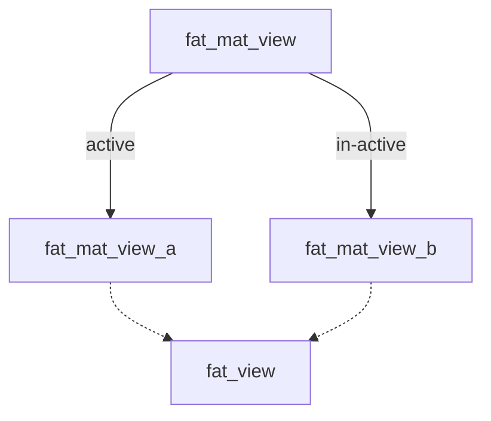

<style>
pre:has(.language-mermaid) { display: none;}
</style>

[PostgreSQL materialized views](https://www.postgresql.org/docs/current/rules-materializedviews.html) offer a way to
store the result of a complex query in a table, which can help avoid repetitive calculations and speed up response times
greatly.

The screenshot below shows off an almost factor 10 speedup in execution time when using a materialized view instead of a 
normal query.


Enough with the motivation, how to create a materialized view?

## Creating the materialized view

In this example, we'll base the materialized view on a view called `fat_view`.

```sql
CREATE MATERIALIZED VIEW fat_mat_view_a AS
SELECT *
FROM fat_view;
```

## Refreshing the materialized view

Caching always involves tradeoffs. Materialized views don’t automatically update, so they can become stale when new data
is added.

An explicit refresh is needed:

```sql
REFRESH MATERIALIZED VIEW fat_mat_view_a;
```

During this refresh operation, the materialized view is completely wiped and repopulated, potentially making the app
unresponsive. This can be problematic in production environments.

A double-buffered approach can help mitigate this issue by alternating between
two materialized views, ensuring one is always up-to-date and ready to use.

## Using a double buffered approach for the materialized view

Instead of refreshing the materialized view directly, we can create two materialized views and switch between them — a
double-buffered approach. This setup allows one view to remain active while the other refreshes.

The idea is to have two materialized views, `fat_mat_view_a` and `fat_mat_view_b`, and one regular view, `fat_mat_view`,
that points to the active materialized view. Here’s a diagram for reference:


<div class="mermaid-svg" style="text-align:center">
<svg aria-roledescription="flowchart-v2" role="graphics-document document" viewBox="0 0 417.125 352" style="max-width: 417.125px; background-color: white;" class="flowchart" xmlns:xlink="http://www.w3.org/1999/xlink" xmlns="http://www.w3.org/2000/svg" width="100%" id="my-svg"><style>#my-svg{font-family:"trebuchet ms",verdana,arial,sans-serif;font-size:16px;fill:#333;}#my-svg .error-icon{fill:#552222;}#my-svg .error-text{fill:#552222;stroke:#552222;}#my-svg .edge-thickness-normal{stroke-width:1px;}#my-svg .edge-thickness-thick{stroke-width:3.5px;}#my-svg .edge-pattern-solid{stroke-dasharray:0;}#my-svg .edge-thickness-invisible{stroke-width:0;fill:none;}#my-svg .edge-pattern-dashed{stroke-dasharray:3;}#my-svg .edge-pattern-dotted{stroke-dasharray:2;}#my-svg .marker{fill:#333333;stroke:#333333;}#my-svg .marker.cross{stroke:#333333;}#my-svg svg{font-family:"trebuchet ms",verdana,arial,sans-serif;font-size:16px;}#my-svg p{margin:0;}#my-svg .label{font-family:"trebuchet ms",verdana,arial,sans-serif;color:#333;}#my-svg .cluster-label text{fill:#333;}#my-svg .cluster-label span{color:#333;}#my-svg .cluster-label span p{background-color:transparent;}#my-svg .label text,#my-svg span{fill:#333;color:#333;}#my-svg .node rect,#my-svg .node circle,#my-svg .node ellipse,#my-svg .node polygon,#my-svg .node path{fill:#ECECFF;stroke:#9370DB;stroke-width:1px;}#my-svg .rough-node .label text,#my-svg .node .label text,#my-svg .image-shape .label,#my-svg .icon-shape .label{text-anchor:middle;}#my-svg .node .katex path{fill:#000;stroke:#000;stroke-width:1px;}#my-svg .rough-node .label,#my-svg .node .label,#my-svg .image-shape .label,#my-svg .icon-shape .label{text-align:center;}#my-svg .node.clickable{cursor:pointer;}#my-svg .root .anchor path{fill:#333333!important;stroke-width:0;stroke:#333333;}#my-svg .arrowheadPath{fill:#333333;}#my-svg .edgePath .path{stroke:#333333;stroke-width:2.0px;}#my-svg .flowchart-link{stroke:#333333;fill:none;}#my-svg .edgeLabel{background-color:rgba(232,232,232, 0.8);text-align:center;}#my-svg .edgeLabel p{background-color:rgba(232,232,232, 0.8);}#my-svg .edgeLabel rect{opacity:0.5;background-color:rgba(232,232,232, 0.8);fill:rgba(232,232,232, 0.8);}#my-svg .labelBkg{background-color:rgba(232, 232, 232, 0.5);}#my-svg .cluster rect{fill:#ffffde;stroke:#aaaa33;stroke-width:1px;}#my-svg .cluster text{fill:#333;}#my-svg .cluster span{color:#333;}#my-svg div.mermaidTooltip{position:absolute;text-align:center;max-width:200px;padding:2px;font-family:"trebuchet ms",verdana,arial,sans-serif;font-size:12px;background:hsl(80, 100%, 96.2745098039%);border:1px solid #aaaa33;border-radius:2px;pointer-events:none;z-index:100;}#my-svg .flowchartTitleText{text-anchor:middle;font-size:18px;fill:#333;}#my-svg rect.text{fill:none;stroke-width:0;}#my-svg .icon-shape,#my-svg .image-shape{background-color:rgba(232,232,232, 0.8);text-align:center;}#my-svg .icon-shape p,#my-svg .image-shape p{background-color:rgba(232,232,232, 0.8);padding:2px;}#my-svg .icon-shape rect,#my-svg .image-shape rect{opacity:0.5;background-color:rgba(232,232,232, 0.8);fill:rgba(232,232,232, 0.8);}#my-svg :root{--mermaid-font-family:"trebuchet ms",verdana,arial,sans-serif;}</style><g><marker orient="auto" markerHeight="8" markerWidth="8" markerUnits="userSpaceOnUse" refY="5" refX="5" viewBox="0 0 10 10" class="marker flowchart-v2" id="my-svg_flowchart-v2-pointEnd"><path style="stroke-width: 1; stroke-dasharray: 1, 0;" class="arrowMarkerPath" d="M 0 0 L 10 5 L 0 10 z"/></marker><marker orient="auto" markerHeight="8" markerWidth="8" markerUnits="userSpaceOnUse" refY="5" refX="4.5" viewBox="0 0 10 10" class="marker flowchart-v2" id="my-svg_flowchart-v2-pointStart"><path style="stroke-width: 1; stroke-dasharray: 1, 0;" class="arrowMarkerPath" d="M 0 5 L 10 10 L 10 0 z"/></marker><marker orient="auto" markerHeight="11" markerWidth="11" markerUnits="userSpaceOnUse" refY="5" refX="11" viewBox="0 0 10 10" class="marker flowchart-v2" id="my-svg_flowchart-v2-circleEnd"><circle style="stroke-width: 1; stroke-dasharray: 1, 0;" class="arrowMarkerPath" r="5" cy="5" cx="5"/></marker><marker orient="auto" markerHeight="11" markerWidth="11" markerUnits="userSpaceOnUse" refY="5" refX="-1" viewBox="0 0 10 10" class="marker flowchart-v2" id="my-svg_flowchart-v2-circleStart"><circle style="stroke-width: 1; stroke-dasharray: 1, 0;" class="arrowMarkerPath" r="5" cy="5" cx="5"/></marker><marker orient="auto" markerHeight="11" markerWidth="11" markerUnits="userSpaceOnUse" refY="5.2" refX="12" viewBox="0 0 11 11" class="marker cross flowchart-v2" id="my-svg_flowchart-v2-crossEnd"><path style="stroke-width: 2; stroke-dasharray: 1, 0;" class="arrowMarkerPath" d="M 1,1 l 9,9 M 10,1 l -9,9"/></marker><marker orient="auto" markerHeight="11" markerWidth="11" markerUnits="userSpaceOnUse" refY="5.2" refX="-1" viewBox="0 0 11 11" class="marker cross flowchart-v2" id="my-svg_flowchart-v2-crossStart"><path style="stroke-width: 2; stroke-dasharray: 1, 0;" class="arrowMarkerPath" d="M 1,1 l 9,9 M 10,1 l -9,9"/></marker><g class="root"><g class="clusters"/><g class="edgePaths"><path marker-end="url(#my-svg_flowchart-v2-pointEnd)" style="" class="edge-thickness-normal edge-pattern-solid edge-thickness-normal edge-pattern-solid flowchart-link" id="L_fat_mat_view_fat_mat_view_a_0" d="M149.878,62L140.841,66.167C131.804,70.333,113.73,78.667,104.693,89C95.656,99.333,95.656,111.667,95.656,124C95.656,136.333,95.656,148.667,95.656,158.333C95.656,168,95.656,175,95.656,178.5L95.656,182"/><path marker-end="url(#my-svg_flowchart-v2-pointEnd)" style="" class="edge-thickness-normal edge-pattern-solid edge-thickness-normal edge-pattern-solid flowchart-link" id="L_fat_mat_view_fat_mat_view_b_1" d="M266.997,62L276.034,66.167C285.071,70.333,303.145,78.667,312.182,89C321.219,99.333,321.219,111.667,321.219,124C321.219,136.333,321.219,148.667,321.219,158.333C321.219,168,321.219,175,321.219,178.5L321.219,182"/><path marker-end="url(#my-svg_flowchart-v2-pointEnd)" style="" class="edge-thickness-normal edge-pattern-dotted edge-thickness-normal edge-pattern-solid flowchart-link" id="L_fat_mat_view_a_fat_view_2" d="M95.656,240L95.656,244.167C95.656,248.333,95.656,256.667,104.088,264.721C112.519,272.775,129.382,280.55,137.814,284.438L146.246,288.325"/><path marker-end="url(#my-svg_flowchart-v2-pointEnd)" style="" class="edge-thickness-normal edge-pattern-dotted edge-thickness-normal edge-pattern-solid flowchart-link" id="L_fat_mat_view_b_fat_view_3" d="M321.219,240L321.219,244.167C321.219,248.333,321.219,256.667,312.787,264.721C304.356,272.775,287.493,280.55,279.061,284.438L270.629,288.325"/></g><g class="edgeLabels"><g transform="translate(95.65625, 124)" class="edgeLabel"><g transform="translate(-21.8984375, -12)" class="label"><foreignObject height="24" width="43.796875"><div style="display: table-cell; white-space: nowrap; line-height: 1.5; max-width: 200px; text-align: center;" class="labelBkg" xmlns="http://www.w3.org/1999/xhtml"><span class="edgeLabel"><p>active</p></span></div></foreignObject></g></g><g transform="translate(321.21875, 124)" class="edgeLabel"><g transform="translate(-31.4921875, -12)" class="label"><foreignObject height="24" width="62.984375"><div style="display: table-cell; white-space: nowrap; line-height: 1.5; max-width: 200px; text-align: center;" class="labelBkg" xmlns="http://www.w3.org/1999/xhtml"><span class="edgeLabel"><p>in-active</p></span></div></foreignObject></g></g><g class="edgeLabel"><g transform="translate(0, 0)" class="label"><foreignObject height="0" width="0"><div style="display: table-cell; white-space: nowrap; line-height: 1.5; max-width: 200px; text-align: center;" class="labelBkg" xmlns="http://www.w3.org/1999/xhtml"><span class="edgeLabel"></span></div></foreignObject></g></g><g class="edgeLabel"><g transform="translate(0, 0)" class="label"><foreignObject height="0" width="0"><div style="display: table-cell; white-space: nowrap; line-height: 1.5; max-width: 200px; text-align: center;" class="labelBkg" xmlns="http://www.w3.org/1999/xhtml"><span class="edgeLabel"></span></div></foreignObject></g></g></g><g class="nodes"><g transform="translate(208.4375, 35)" id="flowchart-fat_mat_view-0" class="node default"><rect height="54" width="158.515625" y="-27" x="-79.2578125" style="" class="basic label-container"/><g transform="translate(-49.2578125, -12)" style="" class="label"><rect/><foreignObject height="24" width="98.515625"><div style="display: table-cell; white-space: nowrap; line-height: 1.5; max-width: 200px; text-align: center;" xmlns="http://www.w3.org/1999/xhtml"><span class="nodeLabel"><p>fat_mat_view</p></span></div></foreignObject></g></g><g transform="translate(95.65625, 213)" id="flowchart-fat_mat_view_a-1" class="node default"><rect height="54" width="175.3125" y="-27" x="-87.65625" style="" class="basic label-container"/><g transform="translate(-57.65625, -12)" style="" class="label"><rect/><foreignObject height="24" width="115.3125"><div style="display: table-cell; white-space: nowrap; line-height: 1.5; max-width: 200px; text-align: center;" xmlns="http://www.w3.org/1999/xhtml"><span class="nodeLabel"><p>fat_mat_view_a</p></span></div></foreignObject></g></g><g transform="translate(321.21875, 213)" id="flowchart-fat_mat_view_b-3" class="node default"><rect height="54" width="175.8125" y="-27" x="-87.90625" style="" class="basic label-container"/><g transform="translate(-57.90625, -12)" style="" class="label"><rect/><foreignObject height="24" width="115.8125"><div style="display: table-cell; white-space: nowrap; line-height: 1.5; max-width: 200px; text-align: center;" xmlns="http://www.w3.org/1999/xhtml"><span class="nodeLabel"><p>fat_mat_view_b</p></span></div></foreignObject></g></g><g transform="translate(208.4375, 317)" id="flowchart-fat_view-5" class="node default"><rect height="54" width="122.09375" y="-27" x="-61.046875" style="" class="basic label-container"/><g transform="translate(-31.046875, -12)" style="" class="label"><rect/><foreignObject height="24" width="62.09375"><div style="display: table-cell; white-space: nowrap; line-height: 1.5; max-width: 200px; text-align: center;" xmlns="http://www.w3.org/1999/xhtml"><span class="nodeLabel"><p>fat_view</p></span></div></foreignObject></g></g></g></g></g></svg></div><!--mermaid-svg-end-->


So we create an additional materialized view, `fat_mat_view_b`, and a view, `fat_mat_view`, that points to the active
one.

```sql
CREATE MATERIALIZED VIEW fat_mat_view_b AS
SELECT *
FROM fat_view;

-- active view
CREATE VIEW fat_mat_view AS
SELECT *
FROM fat_mat_view_a;
```

Remember to add relevant indexes to the materialized views, as needed, to optimize query performance:

```sql
CREATE INDEX fat_mat_view_a_idx ON public.fat_mat_view_a (vat_number, date);
CREATE INDEX fat_mat_view_b_idx ON public.fat_mat_view_b (vat_number, date);
```

## Refreshing the materialized view and switching active view

The active views are queryable through the `pg_views` table. We can use this table to determine the active view, refresh
the other view, and switch to it once ready.

The following SQL script accomplishes this:

```sql
DO
$$
    DECLARE
        active_view TEXT;
    BEGIN
        -- Determine the active view by checking the definition
        SELECT CASE
                   WHEN definition LIKE '%fat_mat_view_a%' THEN 'a'
                   WHEN definition LIKE '%fat_mat_view_b%' THEN 'b'
                   END
        INTO active_view
        FROM pg_views
        WHERE viewname = 'fat_mat_view';

        -- Refresh the inactive view and switch
        IF active_view IS NULL THEN
            RAISE EXCEPTION 'The materialized views does not exist.';
        ELSIF active_view = 'a' THEN
            REFRESH MATERIALIZED VIEW fat_mat_view_b;
            CREATE OR REPLACE VIEW fat_mat_view AS
            SELECT * FROM fat_mat_view_b;
        ELSE
            REFRESH MATERIALIZED VIEW fat_mat_view_a;
            CREATE OR REPLACE VIEW fat_mat_view AS
            SELECT * FROM fat_mat_view_a;
        END IF;
    END
$$;
```

This refresh process can be set up as a cron job, with the frequency determined based on your application's tolerance
for stale data. And that’s it — a simple but effective way to boost performance where a small amount of staleness is
acceptable.
