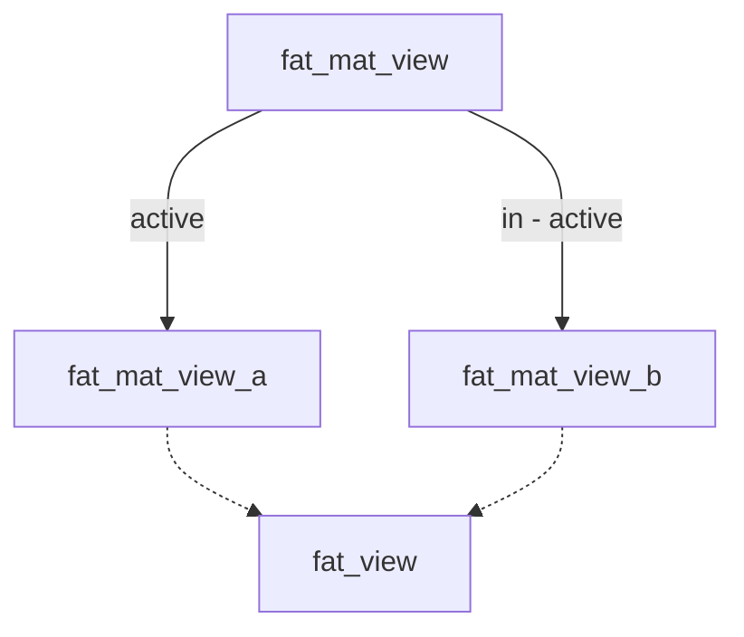

[PostgreSQL materialized views](https://www.postgresql.org/docs/current/rules-materializedviews.html) offer a way to
store the result of a complex query in a table, which can help avoid repetitive calculations and speed up response times
greatly.

Below is an example of an aggregating request taking around 0.75 seconds vs. 0.11 seconds with a materialized view.

### Without materialized view

```bash
curl -o /dev/null --silent --write-out "%{time_total}" 'https://localhost:6004/api/co2-summary?cvrNumber=16227641&fromDate=2023-01-01&toDate=2023-12-31&useMatView=false'
```

Response times were on average around ~0.75 seconds.

### With materialized view

```bash
curl -o /dev/null --silent --write-out "%{time_total}" 'https://localhost:6004/api/co2-summary?cvrNumber=16227641&fromDate=2023-01-01&toDate=2023-12-31&useMatView=true' 
```

Using a materialized view, response times drop to around 0.11 seconds, a sevenfold improvement in this case."

Enough with the motivation, how to create a materialized view?

## Creating the materialized view

In this example, we'll base the materialized view on a view called `fat_view`.

```sql
CREATE MATERIALIZED VIEW fat_mat_view_a AS
SELECT *
FROM fat_view;
```

## Refreshing the materialized view

Caching always involves tradeoffs. Materialized views don’t automatically update, so they can become stale when new data
is added.

An explicit refresh is needed:

```sql
REFRESH MATERIALIZED VIEW fat_mat_view_a;
```

During this refresh operation, the materialized view is completely wiped and repopulated, potentially making the app
unresponsive. This can be problematic in production environments.

A double-buffered approach can help mitigate this issue by alternating between
two materialized views, ensuring one is always up-to-date and ready to use.

## Using a double buffered approach for the materialized view

Instead of refreshing the materialized view directly, we can create two materialized views and switch between them—a
double-buffered approach. This setup allows one view to remain active while the other refreshes.

The idea is to have two materialized views, `fat_mat_view_a` and `fat_mat_view_b`, and one regular view, `fat_mat_view`,
that points to the active materialized view. Here’s a diagram for reference:



So we create an additional materialized view, `fat_mat_view_b`, and a view, `fat_mat_view`, that points to the active
one.

```sql
CREATE MATERIALIZED VIEW fat_mat_view_b AS
SELECT *
FROM fat_view;

-- active view
CREATE VIEW fat_mat_view AS
SELECT *
FROM fat_mat_view_a;
```

Remember to add relevant indexes to the materialized views, as needed, to optimize query performance:

```sql
CREATE INDEX fat_mat_view_a_idx ON public.fat_mat_view_a (vat_number, date);
CREATE INDEX fat_mat_view_b_idx ON public.fat_mat_view_b (vat_number, date);
```

## Refreshing the materialized view and switching active view

The active views are queryable through the `pg_views` table. We can use this table to determine the active view, refresh
the other view, and switch to it once ready.

The following SQL script accomplishes this:

```sql
DO
$$
    DECLARE
        active_view TEXT;
    BEGIN
        -- Determine the active view by checking the definition
        SELECT CASE
                   WHEN definition LIKE '%fat_mat_view_a%' THEN 'a'
                   WHEN definition LIKE '%fat_mat_view_b%' THEN 'b'
                   END
        INTO active_view
        FROM pg_views
        WHERE viewname = 'fat_mat_view';

        -- Refresh the inactive view and switch
        IF active_view IS NULL THEN
            RAISE EXCEPTION 'The materialized views does not exist.';
        ELSIF active_view = 'a' THEN
            REFRESH MATERIALIZED VIEW fat_mat_view_b;
            CREATE OR REPLACE VIEW fat_mat_view AS
            SELECT * FROM fat_mat_view_b;
        ELSE
            REFRESH MATERIALIZED VIEW fat_mat_view_a;
            CREATE OR REPLACE VIEW fat_mat_view AS
            SELECT * FROM fat_mat_view_a;
        END IF;
    END
$$;
```

This refresh process can be set up as a cron job, with the frequency determined based on your application's tolerance
for stale data. And that’s it — a simple but effective way to boost performance where a small amount of staleness is
acceptable.

